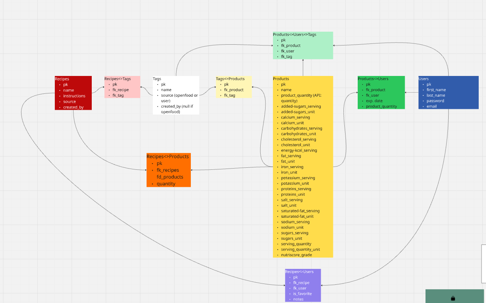

# README

To start the node server, use `npx nodemon index.js`

`Nodemon` is installed so it'll track any changes and automatically apply them so you don't have to restart the server.

[View the ERD on Miro](https://miro.com/app/board/uXjVLKr-ChQ=/)
